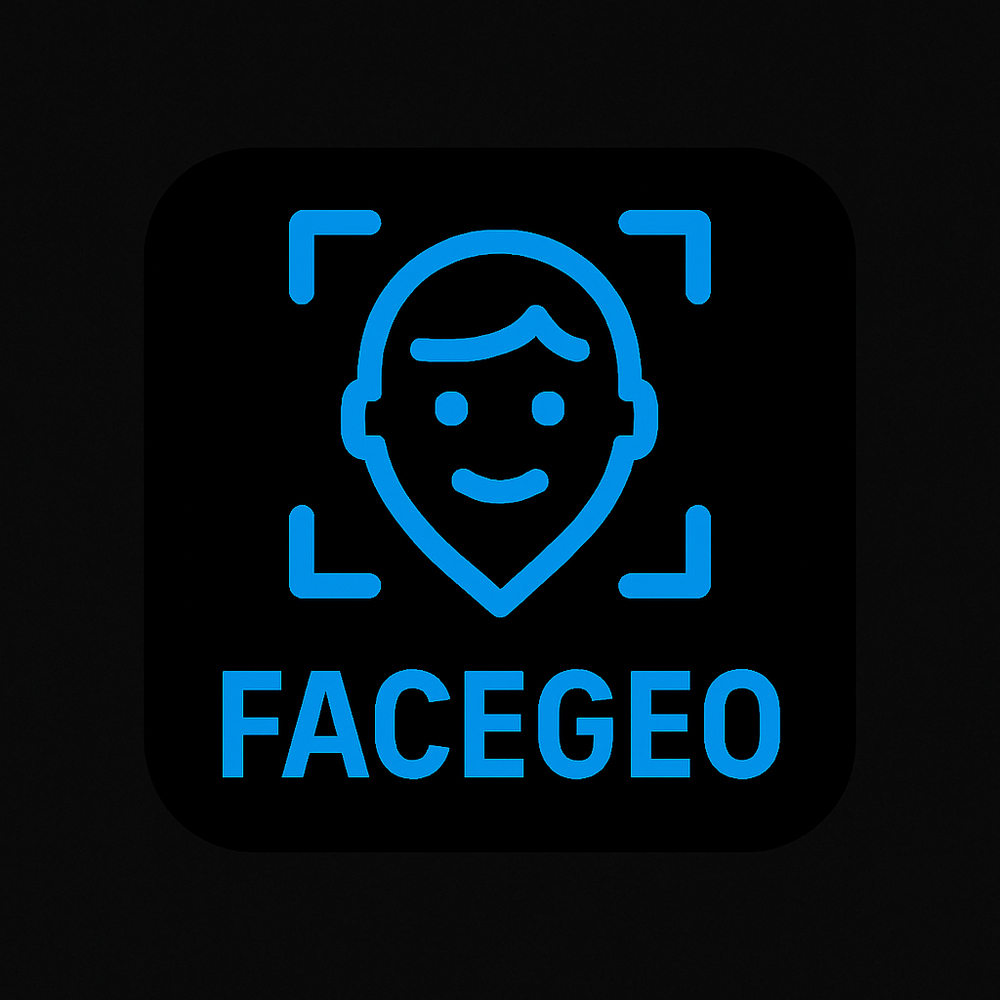
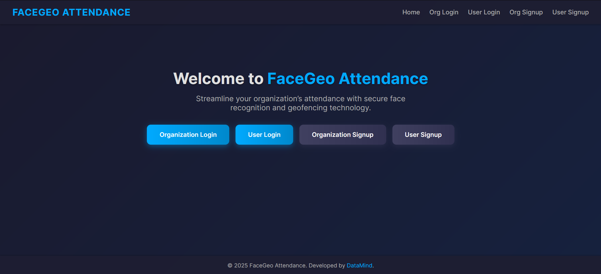
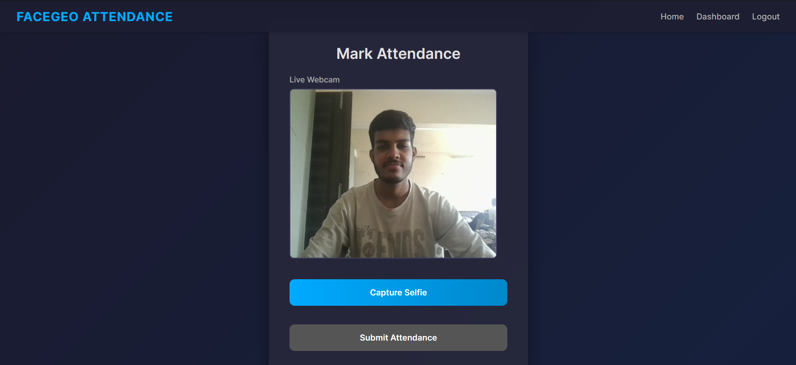
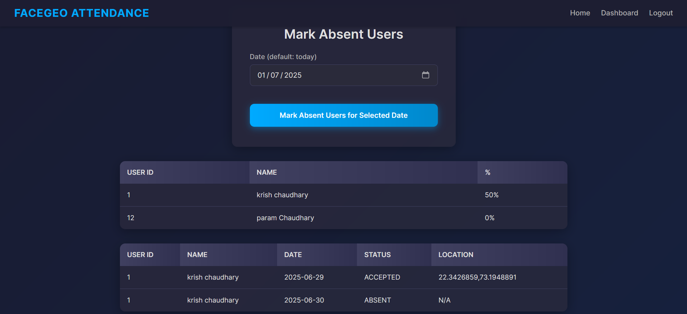
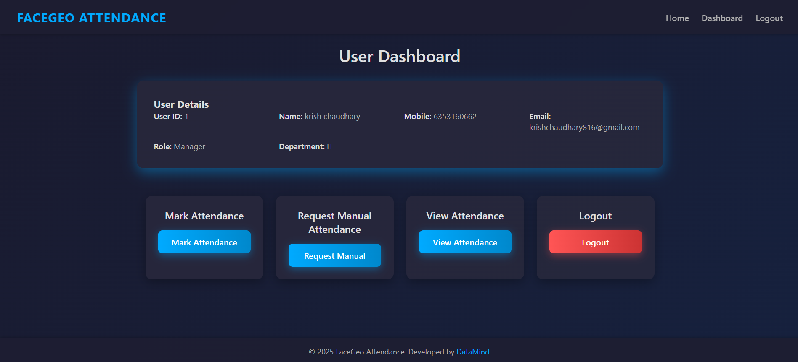
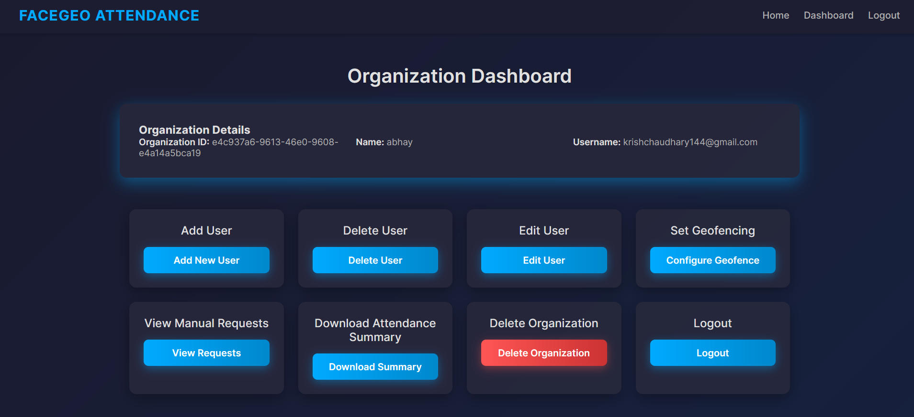

# 👁️‍🗨️ FaceGeo: Revolutionizing Attendance Management

Welcome to **FaceGeo**, a smart attendance management system that combines **facial recognition** and **geo-fencing** technologies for secure, efficient, and fraud-proof attendance tracking — ideal for companies and educational institutions.

---

## 🚀 Key Features

### 🔐 1. Secure Login & Admin Dashboard
- OTP validation and password protection
- Role-based access for organizations and users

### 📸 2. Real-Time Face & Geo Verification
- Face recognition ensures authorized identity
- Geo-fencing validates location presence

### 📊 3. Reports & Summaries
- Exportable daily/monthly attendance summaries
- Approval system for manual requests

### 🧠 4. Smart Workflows
- Distinct organization & user workflows
- Automated validation pipeline

---

## 🧩 Core Capabilities

| Feature               | Description                                                                 |
|------------------------|-----------------------------------------------------------------------------|
| **Facial Recognition** | Advanced face detection & verification for every check-in.                  |
| **Geo-Fencing**        | Validates presence within pre-defined authorized zones.                     |
| **Web-Based Interface**| Accessible from any device for flexible deployments.                        |

---

## 🧑‍💻 Meet Our Team

👨‍💼 **Krish Chaudhary**  
> Specializes in Data Science, ML, and DL. Builds intelligent automation with AI.

👨‍💼 **Raj Kapuriya**  
> Expert in AI-powered systems. Focuses on deploying scalable ML-driven solutions.

---

## 🧭 Project Screenshots

### 🔷 FaceGeo Dashboard

### 🔷 Face & Location Verification

### 🔷 Attendance Summary

### 🔷 Users Dashboard

### 🔷 Organization Dashboard

---

## 🛠️ How It Works

### 👨‍💼 Organization Workflow
1. Register your organization
2. Define geofenced attendance locations
3. Add/manage users
4. Monitor real-time attendance
5. Export reports & approve manual requests

### 🙋‍♂️ User Workflow
1. Login securely
2. Face + Geo validation
3. Attendance is marked automatically
4. View history or raise manual requests if needed

---

## 💡 Why FaceGeo?

✅ **Fraud Prevention** – Stops buddy punching  
✅ **Automated** – Saves HR/Admin time  
✅ **Performance Insights** – Track attendance rates  
✅ **Cross-platform** – Mobile + Web compatible  

---

## 🔗 Demo Presentation

Watch our interactive presentation built with Gamma:  
📎 [View Presentation](https://facegeo-attendance.onrender.com/)

---
